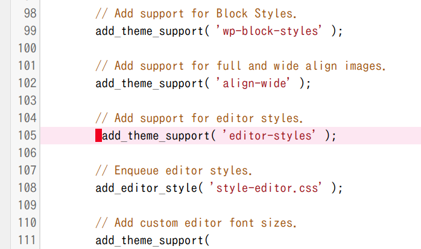

# CodeMirror Special Character Indicator

Extensible special character indicator for CodeMirror, which is useful to avoid hard-to-find errors caused by non-usual characters.

## Backgrounds

CodeMirror which is integrated in WP code editor also supports special characters indicator.

However, the default indicator (red dot) is a bit small. In addition WP doesn't have proper way to extend CodeMirror settings that is not JSON-encodable.

This plugin provides easy-to-find indication and the filter hook to extend special characters.

## Special characters

By default, this plugin emphasizes the special characters below.

### The default special characters defined by CodeMirror

The characters below are the default ones supported by CodeMirror by default.

* U+0000-U+001F
* U+007F-U+009F
* U+00AD
* U+061C
* U+200B-U+200F
* U+2028
* U+2029
* U+FEFF

### Additional special characters

This plugin adds a few characters below.

* U+00A0
* U+FEFE

## Hooks

You can modify special characters what you want to emphasize by the filter hook below.

### apply_filters( 'cmsci_special_chars', $special_chars )

Filters the list of the special characters to highlight.

#### Description

This includes the same elements as the default value of `CodeMirror.defaults.specialChars` option by default.

#### Parameters

* **$special_chars** (string[]) An array of the special characters. Each element is evaluated as a character in RegExp character class.

## LICENSE

* MIT
* GNU General Public License v2 or later

SPDX-License-Identifier: MIT OR GPL-2.0-or-later
